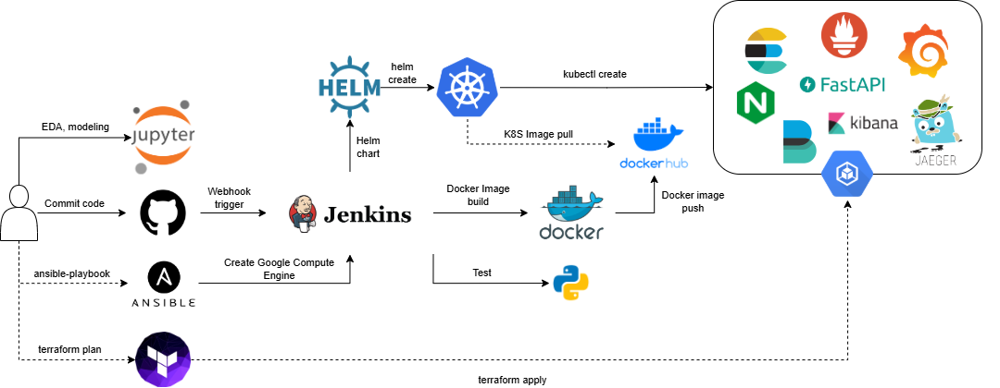

# Diabetes prediction
## Note
+ jenkins_docker folder: deploy jenkins using docker
+ monitoring_docker folder: deploy observable systems using docker
## Repository's structure
```
DO AN
├── ansible
│   ├── deploy_jenkins
│   └── secrets
├── custom_jenkins
├── data
├── helm
│   └── templates
├── images
├── jenkins_docker
├── models
├── monitoring-docker
│   ├── alertmanager
│   │   └── data
│   ├── elk
│   │   ├── elasticsearch
│   │   │   └── config
│   │   ├── extensions
│   │   │   └── filebeat
│   │   │       └── config
│   │   ├── kibana
│   │   │   └── config
│   │   ├── run_env
│   │   └── setup
│   │       └── roles
│   ├── grafana
│   │   ├── config
│   │   └── dashboards
│   ├── instrument
│   │   ├── logs
│   │   │   └── __pycache__
│   │   ├── metrics
│   │   └── traces
│   │       └── __pycache__
│   └── prometheus
│       └── config
├── notebooks
└── terraform
```
## Table of contents
1. [System Architecture](#1-system-architecture)
2. [Installation](#2-installation)
3. [FastAPI](#3-fastapi)
4. [Observable systems](#4-observable-systems)
    1. [ElasticSearch](#41-elasticsearch)
    2. [Prometheus + Grafana + Jaegar](#42-prometheus--grafana--jaegar)
5. [Jenkins](#5-jenkins)
6. [Google Kubernetes Engine](#6-google-kubernetes-engine)
    1. [GKE + Jenkins](#61-gke--jenkins)
    2. [GKE + Deploy app and monitoring services](#62-gke--deploy-app-and-monitoring-services)
## 1. System Architecture

## 2. Installation
+ Tested on Python 3.10, recommended to use a virtual environment like Conda
+ Install requirements: ```pip install -r requirements.txt```
+ EDA + Modeling + Training code: [notebooks/diabetes-predict.ipynb](notebooks/diabetes-predict.ipynb)
+ Data: [data/pima-indians-diabetes.csv](data/pima-indians-diabetes.csv)
+ Docker engine
+ Docker images:
    + [khaibk21/predict-diabetes](https://hub.docker.com/repository/docker/khaibk21/predict-diabetes/general): build diabetes prediction service
    + [fullstackdatascience/jenkins:lts](https://hub.docker.com/r/fullstackdatascience/jenkins/tags): build Jenkins service
    + [fullstackdatascience/jenkins-k8s/lts](https://hub.docker.com/r/fullstackdatascience/jenkins-k8s): build Jenkins service + Helm
## 3. FastAPI
+ ```uvicorn main:app --host 0.0.0.0 --port 4001 --reload```
+ ```ngrok http 4001```
+ You can use the address randomly generated from the code above to access the service.
## 4. Observable systems
### 4.1. ElasticSearch
#### How to guide
+ Enter the following codes in the terminal
```bash
cd monitoring-docker/elk
docker compose -f elk-docker-compose.yml -f extensions/filebeat/filebeat-compose.yml up -d
```
+ You can access Kibana at port 5061 to search logs, which FileBeat pulls from containers and pushes to ElasticSearch. Username and password of Kibana can be found at ```monitoring-docker/elk/.env```
### 4.2. Prometheus + Grafana + Jaegar
#### How to guide
+ Start Prometheus, Grafana (to see metrics), and Jaeger Tracing (to see traces) as follows
```bash
cd monitoring-docker
docker compose -f prom-graf-docker-compose.yaml up -d
```
+ Run a container so that `Filebeat` can collect logs from it
```bash
cd instrument
docker build -t foo -f logs/Dockerfile . && docker run -p 8000:8000 --name demo-logs foo
```
+ Run the app to demonstrate metrics
```bash
cd instrument
docker build -t foo-metrics -f metrics/Dockerfile . && docker run -p 8000:8000 --name demo-metrics foo-metrics
```
+ Access services:
    + Prometheus: http://localhost:9090
    + Grafana: http://localhost:3000 with `username/password` is `admin/admin`
    + Kibana: http://localhost:5601 with `username/password` is `elastic/changeme`
    + Jaeger: http://localhost:16686

## 5. Jenkins
#### How to guide
+ ```docker compose -f jenkins_docker/docker-compose.yml up -d```
+ Access service: http://localhost:8081
+ Connect to github repo using ngrok
+ In **Let me select individual events** in **Setting/Webhooks/Manage webhook**, tick **Pull requests** and **Pushes** to inform Jenkins to run whenever we push or pull code from Github.
+ In Jenkins, click **New item** to create new **Multibranch Pipeline**
+ In **Configuration/Branch Sources**, choose **Github** in **Add source**. Then, click **Add**, choose the multibranch pipeline created before to configure the Github account.
+ In **Credentials**, click **global** in **Stores scoped**, then click **Add Credentials** to add Docker Hub account.

## 6. Google Kubernetes Engine
* In this section, you need an active Google Cloud Platform account, gcloud CLI installed. You also need to autheticate with GCP using the following command: ```gcloud auth application-default login``` and create a service account file.
### 6.1. GKE + Jenkins
#### How to guide
+ Create a virtual machine instance using Ansible
```bash
cd ansible/deploy_jenkins
ansible-playbook create_compute_instance.yaml
```
+ Install Jenkins inside that instance
```bash
ansible-playbook -i ../inventory deploy_jenkins.yml
```
+ Provision a new cluster
```bash
cd ../../terraform
terraform init
terraform plan
terraform apply
```
+ Configure Kubernetes in Jenkins to set up a CI/CD pipeline:
    + In **Manage Jenkins**, click **Plugins**
    + Click **Available plugins**, search **kubernetes** and choose **Kubernetes 4029.v5712230ccb_f8**
    + In **Manage Jenkins**, click **Nodes and Clouds**, then click **Clouds**
    + Click **Add a new cloud**, choose **Kubernetes**
    + In **Kubernetes Cloud details**, fill in **Kubernetes URL**, **Kubernetes server certificate key** and **Jenkins URL**
    + Provide some permissions for Jenkins
```bash
kubectl create clusterrolebinding cluster-admin-binding \
--clusterrole=cluster-admin --user=system:anonymous

kubectl create clusterrolebinding cluster-admin-default-binding --clusterrole=cluster-admin --user=system:serviceaccount:default:default
```
### 6.2. GKE + Deploy app and monitoring services
+ In GKE UI, click on the previously created cluster and select **CONNECT**. A pop-up will appear.
+ In this pop-up, click **Copy to clipboard** to copy the following command into the local terminal
```bash
gcloud container clusters get-credentials <your_gke_name> --zone us-central1-c --project <your_project_id>
``` 
+ Switch to your GKE cluster using kubectx
```bash
kubectx <YOUR_GKE_CLUSTER>
```
+ Install the ```nginx controller``` on this new cluster to route traffic from outside to services within the cluster
```bash
helm upgrade --install ingress-nginx ingress-nginx --repo https://kubernetes.github.io/ingress-nginx --namespace ingress-nginx --create-namespace
```
+ Use ```helm``` to install Prometheus and Grafana on that cluster
```bash
cd ./monitoring-k8s
helm upgrade --install prometheus-grafana-stack -f values-prometheus.yaml kube-prometheus-stack --namespace monitoring --create-namespace
```